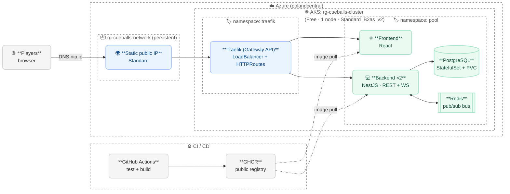
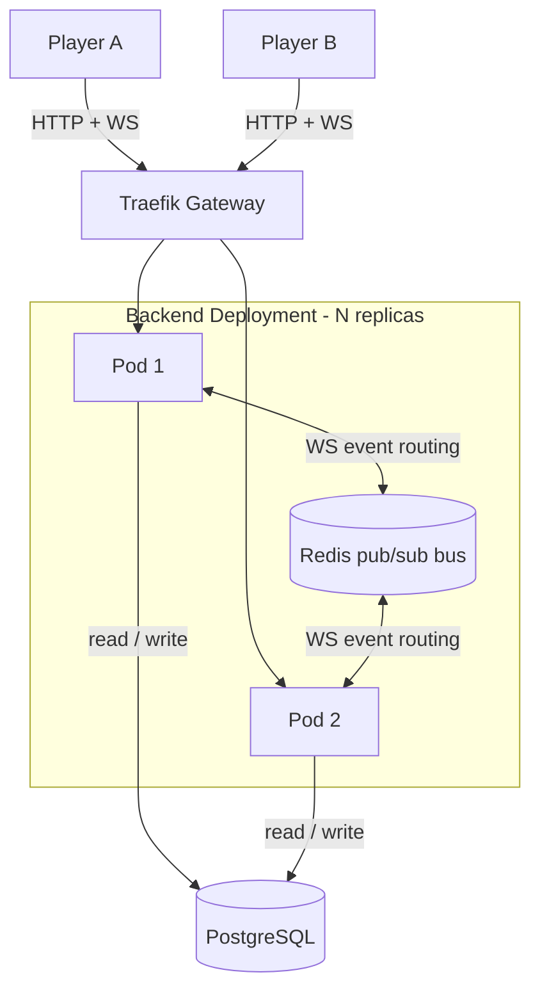
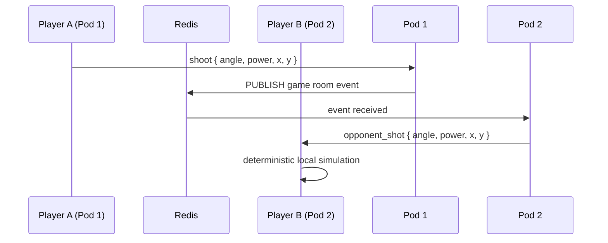

# Cue & Balls

Online 1v1 American 8-ball pool, playable in a desktop browser. Players authenticate
with JWT and play real-time matches: the physics simulation runs deterministically on
the client, while the backend validates and persists the authoritative game state.

The central technical goal is a resilient, horizontally scalable deployment on
Kubernetes, startable in a single command.

## Features

- Player accounts with JWT authentication (register / login)
- Lobby: create a game or join an open one
- Real-time 1v1 matches over WebSocket
- American 8-ball ruleset, validated server-side
- Disconnection handling with reconnection from persisted state

## Problem statement

The core challenge is keeping a real-time connection consistent between two players on a
distributed, horizontally scaled backend. With several backend pods behind a load
balancer, the two players of a match can be connected to different pods. A shot emitted
on one pod must reach the opponent's socket living on another pod, without the
application code having to know the pod topology.

## Application architecture

### Deterministic shot protocol

The physics engine runs client-side and is deterministic, so the server never simulates
a shot. The exchange is:

1. The shooting player emits `shoot` with the shot parameters (angle, power, cue ball
   position).
2. The server validates turn ownership and forwards `opponent_shot` to the other player.
3. Both clients run the same deterministic simulation from the same parameters and
   converge on the same end state.
4. The shooting client emits `shot_resolved` with the final ball state.
5. The server validates the rules, persists the result, and broadcasts the authoritative
   `shot_result` to both players.

The full event flow is documented in [`doc/ws_contract.yaml`](doc/ws_contract.yaml) and
the end-to-end gameplay sequence diagram in [`doc/game-flow.md`](doc/game-flow.md).

### Cross-pod WebSocket routing

Routing between pods relies on the Socket.IO Redis adapter. A pod publishes WebSocket
events to Redis; the other pods receive them and deliver them to their local sockets.
Each match uses a Socket.IO room keyed by the game id. The NestJS code stays identical
whatever the pod topology:

```ts
socket.to(roomId).emit('opponent_shot', shotParams);
```

Redis is used as a pub/sub bus only, never as an application cache or state store. If
Redis goes down, players lose real-time sync but no data is lost: state is reread from
PostgreSQL on reconnection.







### State persistence

PostgreSQL is the single source of truth. At each resolved shot, the server persists ball
positions, turn ownership and game status in a single transaction. There is no
intermediate persistence while balls are in motion.

### Resilience

- The backend runs as a Deployment with N replicas and an HPA. A crashed pod is restarted
  by Kubernetes, and clients reconnect automatically through the WebSocket retry.
- On an unexpected disconnect, the server notifies the opponent and starts a reconnection
  timer (TTL). The reconnecting client fetches the current state via `GET /games/:id`,
  then rejoins the WebSocket room and the timer is cancelled. If the TTL expires first,
  the match ends.

## Infrastructure overview

The application is deployed on Azure Kubernetes Service (AKS), provisioned with Terraform.
External routing is handled by Traefik, implementing the Kubernetes Gateway API.

A static public IP is provisioned separately and kept outside the Terraform lifecycle, so
it survives `terraform destroy` / `apply` cycles and gives a stable endpoint. This is a
deliberate architecture choice, detailed in the deployment manual.

Container images are built and published to GHCR by the CI pipeline, then pulled by the
cluster. Image references are externalized per environment, so rolling out an image is an
infrastructure concern, not a code change.

A local alternative on Minikube is available with the same Traefik / Gateway API setup.

Full procedures are in the [deployment manual](doc/deployment-manual.md).

## Tech stack

| Layer            | Technology                                             |
|------------------|--------------------------------------------------------|
| Frontend         | ReactJS + Pixie.js (client physics engine) |
| Backend          | NestJS 11                                              |
| ORM              | Prisma 7                                               |
| Database         | PostgreSQL 16                                          |
| Inter-pod bus    | Redis 7 (Socket.IO adapter, pub/sub only)              |
| Auth             | JWT + Passport (NestJS)                                |
| API              | REST + WebSocket (Socket.IO)                           |
| Container infra  | Kubernetes (AKS in the cloud, Minikube locally)        |
| Provisioning     | Terraform (azurerm)                                    |
| Ingress          | Traefik (Gateway API)                                  |
| CI/CD            | GitHub Actions + GHCR                                  |

## Repository structure

```
cue-and-balls/
├── backend/                 # NestJS 11 API (REST + WebSocket)
│   ├── src/
│   ├── prisma/
│   └── deploy/k8s/          # Deployment, Service, HTTPRoute, Secret
├── frontend/                # ReactJS client (separate team)
│   ├── src/
│   ├── public/
│   └── deploy/k8s/
├── db/
│   └── deploy/k8s/          # PostgreSQL StatefulSet, PVC, Service, Secret
├── redis/
│   └── deploy/k8s/          # Redis StatefulSet
├── cluster/
│   ├── terraform/           # AKS provisioning (azurerm)
│   ├── k8s/
│   │   ├── pool/            # shared namespace + Gateway + GHCR pull secret
│   │   ├── traefik/         # Traefik Helm values
│   │   ├── .env.azure       # env vars for the Azure deployment
│   │   └── .env.local       # env vars for the Minikube deployment
│   ├── minikube/            # local dev helper scripts
│   └── deploy-azure.sh      # one-command AKS deployment
└── doc/
    ├── rest_contract.yaml   # REST API contract (OpenAPI 3.1)
    ├── ws_contract.yaml     # WebSocket API contract (AsyncAPI 3.0)
    ├── deployment-manual.md # cloud and local deployment procedures
    └── game-flow.md         # end-to-end gameplay sequence diagram
```

The detailed backend module structure is documented in
[`backend/doc/specs_backend.md`](backend/doc/specs_backend.md).

## CI/CD

Continuous integration runs on GitHub Actions with path-based triggering
(`dorny/paths-filter`), so the backend and frontend pipelines only run on changes that
affect them in the monorepo. A test job gates the backend image build, and the frontend
build runs in parallel. Images are pushed to GHCR and tagged with a manual semver bump.

That version bump is what drives image updates on the cluster: with an `IfNotPresent`
pull policy, reusing the same tag has no effect, so a new version must be published to
roll out a new image.

<!-- TODO: insert CI/CD workflow sequence diagram here -->

## Limitations and next steps

- Observability (centralized logging, monitoring) is not implemented yet, left out due to
  time constraints. It is the next planned step.
- TLS / cert-manager is deferred; the demo runs over HTTP.
- JWT access token only, no refresh token (MVP scope).

## Documentation

- [REST API contract](doc/rest_contract.yaml) (OpenAPI 3.1)
- [WebSocket API contract](doc/ws_contract.yaml) (AsyncAPI 3.0)
- [Gameplay sequence diagram](doc/global-workflow.md)
- [Deployment manual](doc/deployment-manual.md)
- [Backend specs](backend/doc/specs_backend.md)
- [Backend README](backend/README.md) (pure local backend development)

## Getting started

To deploy the stack, on Azure (priority) or locally on Minikube, follow the
[deployment manual](doc/deployment-manual.md).

For local backend development without a cluster, see the
[backend README](backend/README.md).