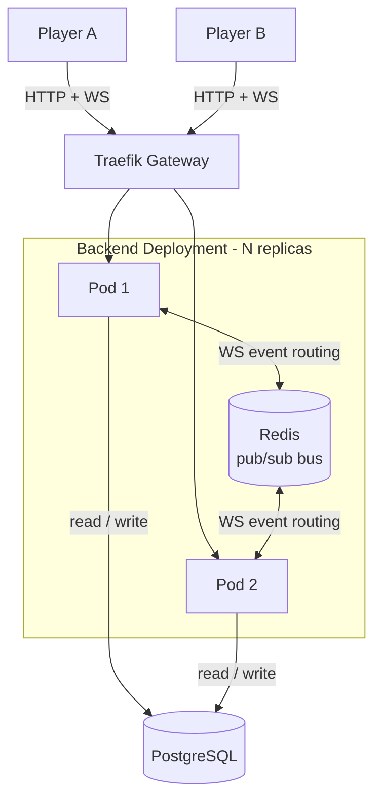
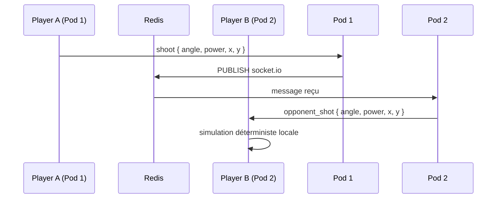
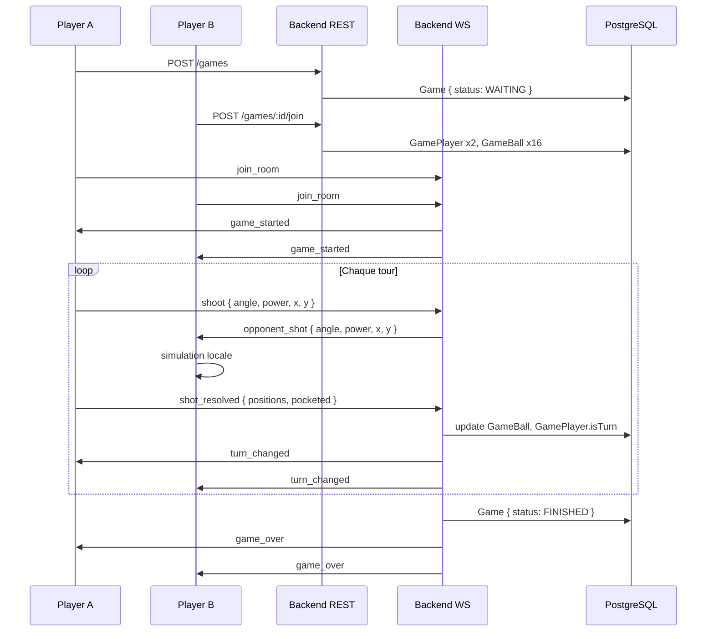

# Architecture - Billard 2D Multijoueur

## Stack

| Couche | Techno |
|---|---|
| Backend | NestJS + Prisma |
| Base de données | PostgreSQL |
| Bus inter-pods | Redis (Socket.io adapter) |
| Auth | JWT + Passport |
| Infra | Kubernetes (Minikube) |
| Ingress | Traefik Gateway API |

---

## Vue globale



---

## Routage WebSocket inter-pods

Le problème : Player A connecté sur Pod 1, Player B sur Pod 2. Sans coordination, Pod 1 ne peut pas atteindre le socket de Player B.

**Solution : Socket.io Redis adapter**



Le code NestJS reste identique quelle que soit la topologie des pods :
```ts
socket.to(roomId).emit('opponent_shot', shotParams);
```

---

## Responsabilités par composant

### PostgreSQL
Persistence de l'état du jeu. Écrit à chaque fin de tour.

Entités : `Game`, `Player`, `GamePlayer`, `Ball`, `GameBall`

### Redis
Uniquement le bus de messages pour le Socket.io adapter. Pas d'état applicatif stocké. Si Redis tombe, les joueurs perdent la synchro temps réel mais aucune donnée n'est perdue - reconnexion = état relu depuis PostgreSQL.

### Backend (NestJS)
- API REST : auth, lobby, état de partie
- WebSocket Gateway : événements de jeu en temps réel
- Validation des tirs et des règles métier
- Écriture en base à chaque fin de tour

---

## Composants Kubernetes

| Composant | Type | Replicas |
|---|---|---|
| Backend | Deployment | N (HPA) |
| PostgreSQL | StatefulSet | 1 + PVC |
| Redis | StatefulSet | 1 + PVC |

Le frontend est géré par une autre équipe.

---

## Flux d'une partie

