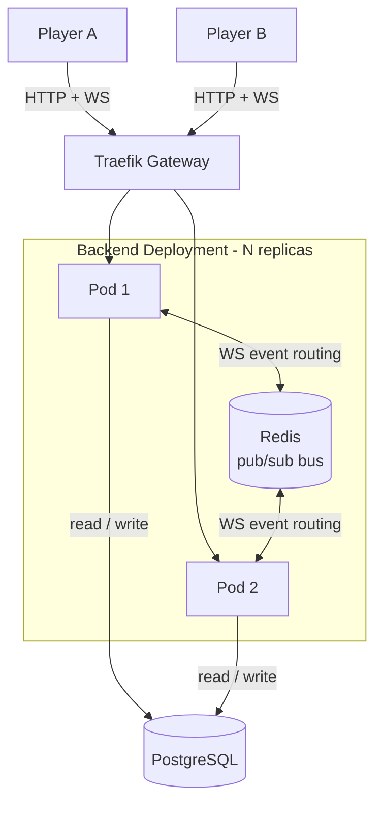
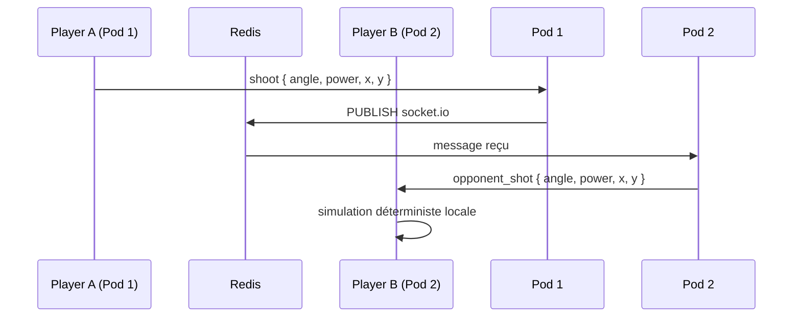
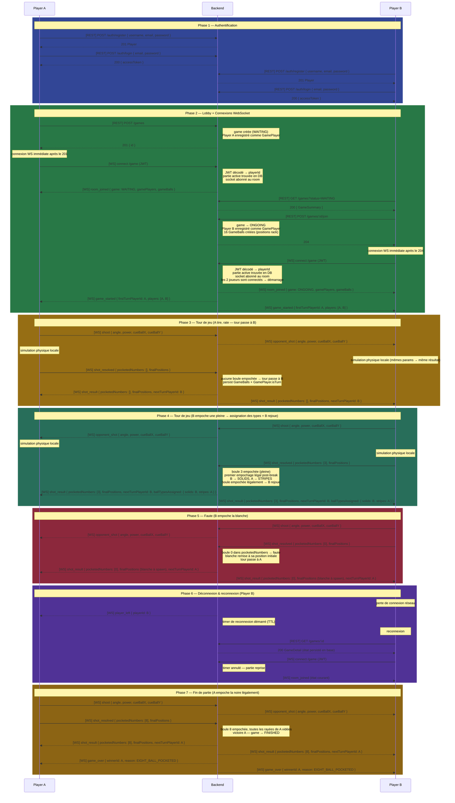

# Cue & Balls - Specs Projet

## Pitch

Jeu de billard 8-ball (variante américaine) en ligne, multijoueur 1v1, accessible via navigateur desktop. Comptes joueurs avec authentification JWT, parties en temps réel avec simulation physique déterministe côté client. Objectif technique central : déploiement résilient et hautement disponible sur Kubernetes, démarrable en une seule commande.

---

## Stack technique

| Couche | Technologie |
|---|---|
| Frontend | ReactJS + moteur physique client (Matter.js ou Planck.js) |
| Backend | NestJS 11 |
| ORM | Prisma 7 |
| Base de données | PostgreSQL 16 |
| Bus inter-pods | Redis 7 (Socket.io adapter, pub/sub uniquement) |
| Auth | JWT + Passport (NestJS) |
| API | REST + WebSocket (Socket.IO) |
| Infra | Kubernetes (Minikube) |
| Ingress | Traefik Gateway API |

---

## Infrastructure

### Cluster

Kubernetes via Minikube (local, 1 noeud physique). Déploiement complet en une commande (`kubectl apply -k .`).

Accès DNS via nip.io (IP encodée dans le nom de domaine, sans configuration DNS) :

| Tier | URL |
|---|---|
| Frontend | `http://web.<ip>.nip.io` |
| Backend | `http://api.<ip>.nip.io` |

### Composants Kubernetes

| Composant | Type K8s | Replicas |
|---|---|---|
| Backend (NestJS) | Deployment + HPA | N |
| PostgreSQL | StatefulSet | 1 + PVC |
| Redis | StatefulSet | 1 + PVC |
| Frontend (ReactJS) | Deployment | N |

Le routage externe est assuré par la Gateway API (objets `Gateway` + `HTTPRoute`), implémentée par Traefik.

Le frontend est géré par une autre équipe.

### Vue globale



### Haute disponibilité

Plusieurs replicas backend. Si un pod crash, K8s le redémarre automatiquement. Le client reconnecte via retry WebSocket automatique.

Redis pub/sub pour le routage des événements WebSocket inter-pods : un événement émis sur un pod est reçu par tous les autres via le `@socket.io/redis-adapter`. Le code NestJS ne change pas selon la topologie des pods.

Si Redis tombe : les joueurs perdent la synchro temps réel mais aucune donnée n'est perdue. A la reconnexion, l'état est relu depuis PostgreSQL.

---

## Routage WebSocket inter-pods

Le problème : Player A connecté sur Pod 1, Player B sur Pod 2. Sans coordination, Pod 1 ne peut pas atteindre le socket de Player B.

**Solution : Socket.io Redis adapter**



Le code NestJS reste identique quelle que soit la topologie des pods :

```ts
socket.to(roomId).emit('opponent_shot', shotParams);
```

---

## Règles du billard (8-ball américain)

- 16 balles : blanche (0), pleines 1-7, noire (8), rayées 9-15
- Chaque joueur est assigné à un type (SOLIDS ou STRIPES) au premier empochage légal post-break
- Un joueur doit vider toutes ses balles avant de pouvoir empocher la noire
- Empocher la noire avant d'avoir vidé ses balles = défaite immédiate (`FOUL_ON_EIGHT`)
- Empocher la blanche = faute : tour à l'adversaire, blanche remise à la position de spawn
- Empocher une balle légalement = rejouer
- Manquer = tour à l'adversaire

---

## Cinématique complète

> `[REST]` = requête HTTP classique (requête/réponse)
> `[WS]` = événement Socket.IO (push serveur, pas de cycle requête/réponse)



---

## Hors scope MVP

- Mobile (PWA envisageable ultérieurement)
- Historique des parties
- Classement / ELO
- Variante française du billard
- Refresh token (JWT access token uniquement)