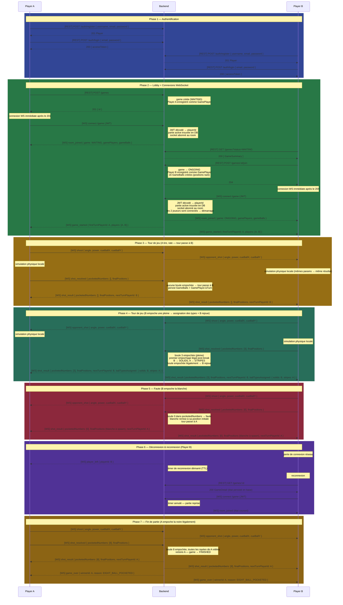

# Cue & Balls - Global worflow

> `[REST]` = requête HTTP classique (requête/réponse)   
> `[WS]` = événement Socket.IO (push serveur, pas de cycle requête/réponse)

```mermaid
sequenceDiagram
    participant PA as Player A
    participant SRV as Backend
    participant PB as Player B

    rect rgb(50, 70, 150)
        Note over PA,PB: Phase 1 — Authentification
        PA->>SRV: [REST] POST /auth/register { username, email, password }
        SRV-->>PA: 201 Player
        PA->>SRV: [REST] POST /auth/login { email, password }
        SRV-->>PA: 200 { accessToken }

        PB->>SRV: [REST] POST /auth/register { username, email, password }
        SRV-->>PB: 201 Player
        PB->>SRV: [REST] POST /auth/login { email, password }
        SRV-->>PB: 200 { accessToken }
    end

    rect rgb(40, 120, 70)
        Note over PA,PB: Phase 2 — Lobby + Connexions WebSocket
        PA->>SRV: [REST] POST /games
        Note right of SRV: game créée (WAITING)<br/>Player A enregistré comme GamePlayer
        SRV-->>PA: 201 { id }

        Note over PA: connexion WS immédiate après le 201
        PA->>SRV: [WS] connect /game (JWT)
        Note right of SRV: JWT décodé → playerId<br/>partie active trouvée en DB<br/>socket abonné au room
        SRV-->>PA: [WS] room_joined { game: WAITING, gamePlayers, gameBalls }

        PB->>SRV: [REST] GET /games?status=WAITING
        SRV-->>PB: 200 [ GameSummary ]

        PB->>SRV: [REST] POST /games/:id/join
        Note right of SRV: game → ONGOING<br/>Player B enregistré comme GamePlayer<br/>16 GameBalls créées (positions rack)
        SRV-->>PB: 204

        Note over PB: connexion WS immédiate après le 204
        PB->>SRV: [WS] connect /game (JWT)
        Note right of SRV: JWT décodé → playerId<br/>partie active trouvée en DB<br/>socket abonné au room<br/>les 2 joueurs sont connectés → démarrage
        SRV-->>PB: [WS] room_joined { game: ONGOING, gamePlayers, gameBalls }
        SRV-->>PA: [WS] game_started { firstTurnPlayerId: A, players: [A, B] }
        SRV-->>PB: [WS] game_started { firstTurnPlayerId: A, players: [A, B] }
    end

    rect rgb(150, 110, 20)
        Note over PA,PB: Phase 3 — Tour de jeu (A tire, rate — tour passe à B)
        PA->>SRV: [WS] shoot { angle, power, cueBallX, cueBallY }
        SRV-->>PB: [WS] opponent_shot { angle, power, cueBallX, cueBallY }

        Note over PA: simulation physique locale
        Note over PB: simulation physique locale (mêmes params → même résultat)

        PA->>SRV: [WS] shot_resolved { pocketedNumbers: [], finalPositions }
        Note right of SRV: aucune boule empochée → tour passe à B<br/>persist GameBalls + GamePlayer.isTurn
        SRV-->>PA: [WS] shot_result { pocketedNumbers: [], finalPositions, nextTurnPlayerId: B }
        SRV-->>PB: [WS] shot_result { pocketedNumbers: [], finalPositions, nextTurnPlayerId: B }
    end

    rect rgb(40, 110, 90)
        Note over PA,PB: Phase 4 — Tour de jeu (B empoche une pleine → assignation des types + B rejoue)
        PB->>SRV: [WS] shoot { angle, power, cueBallX, cueBallY }
        SRV-->>PA: [WS] opponent_shot { angle, power, cueBallX, cueBallY }

        Note over PA: simulation physique locale
        Note over PB: simulation physique locale

        PB->>SRV: [WS] shot_resolved { pocketedNumbers: [3], finalPositions }
        Note right of SRV: boule 3 empochée (pleine)<br/>premier empochage légal post-break<br/>B → SOLIDS, A → STRIPES<br/>boule empochée légalement → B rejoue
        SRV-->>PA: [WS] shot_result { pocketedNumbers: [3], finalPositions, nextTurnPlayerId: B, ballTypesAssigned: { solids: B, stripes: A } }
        SRV-->>PB: [WS] shot_result { pocketedNumbers: [3], finalPositions, nextTurnPlayerId: B, ballTypesAssigned: { solids: B, stripes: A } }
    end

    rect rgb(140, 40, 60)
        Note over PA,PB: Phase 5 — Faute (B empoche la blanche)
        PB->>SRV: [WS] shoot { angle, power, cueBallX, cueBallY }
        SRV-->>PA: [WS] opponent_shot { angle, power, cueBallX, cueBallY }

        PB->>SRV: [WS] shot_resolved { pocketedNumbers: [0], finalPositions }
        Note right of SRV: boule 0 dans pocketedNumbers → faute<br/>blanche remise à sa position initiale<br/>tour passe à A
        SRV-->>PA: [WS] shot_result { pocketedNumbers: [0], finalPositions (blanche à spawn), nextTurnPlayerId: A }
        SRV-->>PB: [WS] shot_result { pocketedNumbers: [0], finalPositions (blanche à spawn), nextTurnPlayerId: A }
    end

    rect rgb(80, 50, 150)
        Note over PA,PB: Phase 6 — Déconnexion & reconnexion (Player B)
        Note over PB: perte de connexion réseau
        SRV-->>PA: [WS] player_left { playerId: B }
        Note right of SRV: timer de reconnexion démarré (TTL)

        Note over PB: reconnexion
        PB->>SRV: [REST] GET /games/:id
        SRV-->>PB: 200 GameDetail (état persisté en base)

        PB->>SRV: [WS] connect /game (JWT)
        Note right of SRV: timer annulé — partie reprise
        SRV-->>PB: [WS] room_joined (état courant)
    end

    rect rgb(140, 100, 20)
        Note over PA,PB: Phase 7 — Fin de partie (A empoche la noire légalement)
        PA->>SRV: [WS] shoot { angle, power, cueBallX, cueBallY }
        SRV-->>PB: [WS] opponent_shot { angle, power, cueBallX, cueBallY }

        PA->>SRV: [WS] shot_resolved { pocketedNumbers: [8], finalPositions }
        Note right of SRV: boule 8 empochée, toutes les rayées de A vidées<br/>victoire A — game → FINISHED
        SRV-->>PA: [WS] shot_result { pocketedNumbers: [8], finalPositions, nextTurnPlayerId: A }
        SRV-->>PB: [WS] shot_result { pocketedNumbers: [8], finalPositions, nextTurnPlayerId: A }
        SRV-->>PA: [WS] game_over { winnerId: A, reason: EIGHT_BALL_POCKETED }
        SRV-->>PB: [WS] game_over { winnerId: A, reason: EIGHT_BALL_POCKETED }
    end
```
